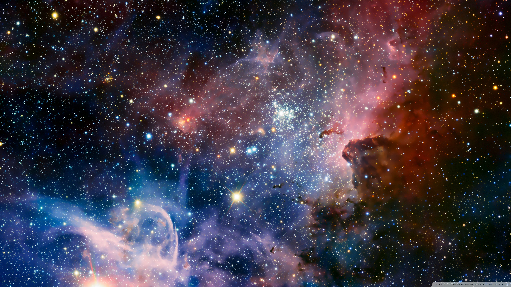

<<<<<<< HEAD
# Image_align
This is a repository designed for storing code that facilitates the alignment of RGB and thermal data both temporally and spatially, even when taken from different perspectives.

I plan to later update the code responsible for temporal alignment.

Inside the file "crop_align.py," a method is outlined to spatially align the collected RGB and thermal information.

Here's a brief explanation of this method:
Given that the RGB camera and thermal camera capture differing fields of view, yet multi-info deep learning models require the RGB-thermal image pair to depict the same scene, alignment of these distinct images becomes necessary. In this approach, we assume that the narrower field of view within an image captures a section of the wider field of view image. Therefore, we generate aligned image pairs by cropping specific regions from the larger image and subsequently scaling them. The region to be selected within the larger image is determined by matching common features such as people, buildings, trees, etc., in both images.

Steps of the method:

Utilize an advanced object detection model like YOLO8 to detect features within both images. While this process is straightforward for simpler scenes, more complex scenes might pose challenges in obtaining matched features. Pairs of features, represented as bounding boxes, will be saved as .json files.
Read the JSON file and adjust the scale of the larger image to match the dimensions of the bounding boxes in both images.
Based on the absolute coordinates of corresponding points in the smaller image's field of view, extract a specific area from the scaled larger image.
Resize the cropped region from the larger image to achieve the desired resolution.
=======
#### Image_align
This is a repository to store the code for aligning the RGB and thermal info with different viewpoint.

>>>>>>> 8dacd1dbfdae7fb03d95d9fd1846e9099b5d0803
